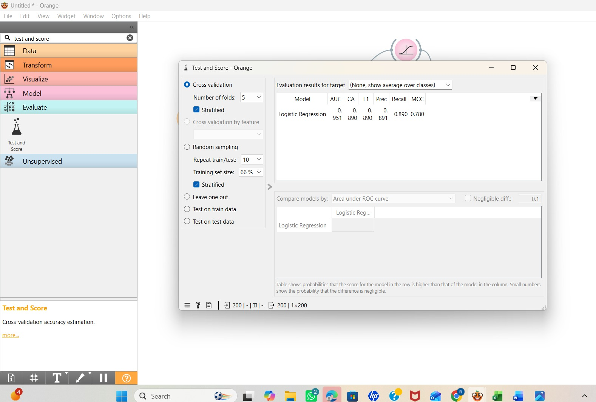
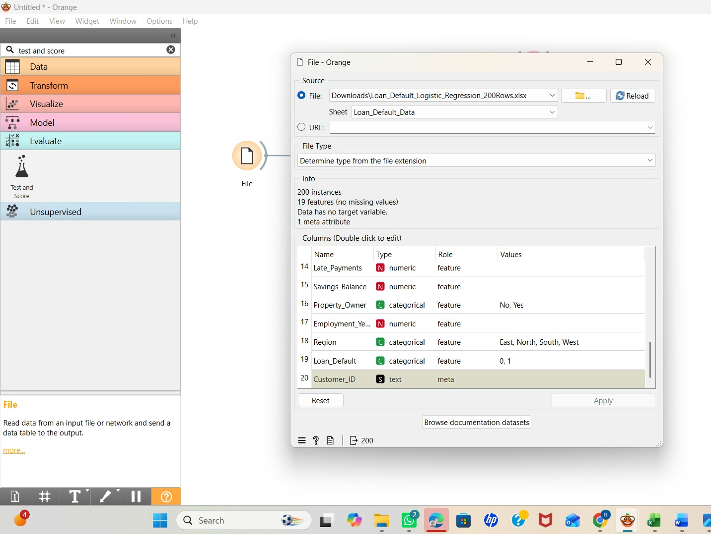

# 🏦 Loan Default Prediction Using Orange

## 📌 Project Overview
This project demonstrates how to build a **Loan Default Prediction Model** using the **Orange Data Mining Tool**, a no-code/low-code machine learning platform. The objective is to predict whether a borrower is likely to default on a loan based on financial and demographic information.

The project is designed for MBA Finance students, business analysts, and beginners who want to learn predictive analytics without writing code.

---

## 🎯 Business Problem

Financial institutions face significant losses due to loan defaults. By analyzing borrower characteristics such as income, employment status, credit history, and loan amount, lenders can identify high-risk applicants and make better lending decisions.

This project helps answer:

- Which borrowers are likely to default?
- What factors contribute most to default risk?
- How accurately can machine learning predict loan defaults?

Loan default prediction is widely used in credit risk management and lending decisions. :contentReference[oaicite:0]{index=0}

---

## 🛠 Tool Used

- Orange Data Mining
- Excel Dataset (.xlsx)
- Logistic Regression
- Data Visualization Widgets
- Confusion Matrix
- ROC Analysis
- Test & Score Widget

---
## Screenshots

### Google Sheet Dataset

### Orange Workflow

### Data Preprocessing

### Model Training & Evaluation

### Loan Default Prediction Results

## 📂 Repository Structure
## Author

**Mehak Sharma**

Loan Approval Prediction using Orange Data Mining for credit risk assessment and loan approval decision-making.

